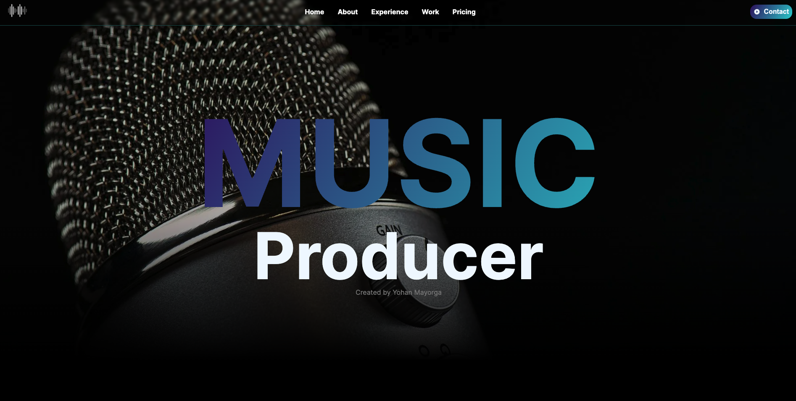
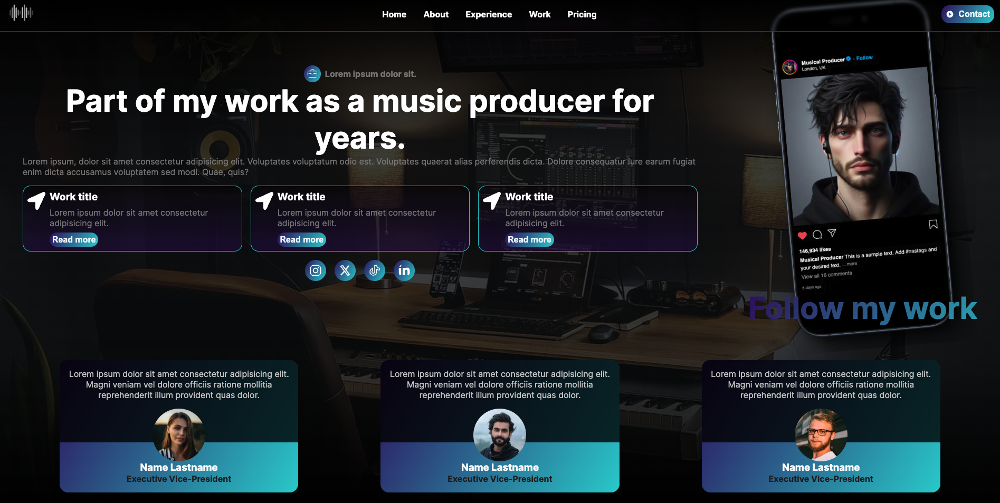
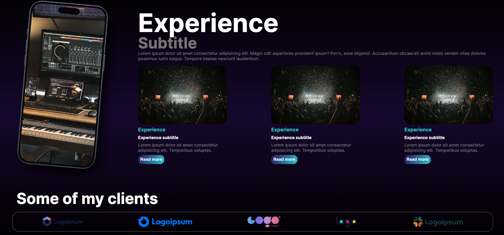

# Music Producer

web page dedicated to showing the work of a music producer, his profile, his experience, and his means of contact. The format can be applied to any profession. The purpose of this project is to demonstrate knowledge in the use of TypeScript, JavaScript, HTML and CSS for front end development.



## Used tools

```bash
HTML, CSS, JavaScript, TypeScript, NextJS, React.
```

## How does it work?

The page contains different sections to display information. At the top you will have the menu with each of the sections, and the user will be able to scroll through the entire document using the links.


This project is a front end only project, however, back end functionality can be incorporated depending on the user's requirements.


## Learn More

This open source project is completely free to use, download and customize.

## Deploy on Vercel

The website is available at this [link.](https://musicproducer.vercel.app/)
